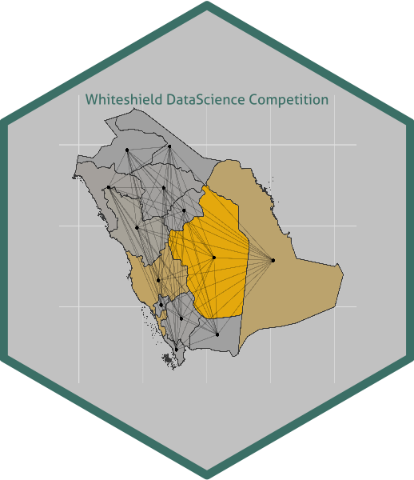

# whiteshield 

### Files of the repository

    ├── utils.R

This file loads the packages and the commonly used functions. Run this script before any other script you want to evaluate.

    ├── data-upload.R
    ├── data-setup.R

We loaded the enclosed data and exported that into a private OneDrive folder via the awesome [{pins}](https://pins.rstudio.com) package. We also saved all intermediate results in this folder. Please e-mail us if you wish to access the folder: [granat.marcell\@uni-neumann.hu](mailto:granat.marcell@uni-neumann.hu)

    ├── 01-extract_nonenglish.R
    ├── 02-translate.py
    ├── 03-merge_translation.R
    
As a first, we extracted the non-english sentences from the job posts and trasnlated them via Python.    
    
    ├── 04-sbert.R
    ├── 04-sbert.py
    ├── 05-bert_matching.R
    
    ├── 07-bert-skills.R
    ├── 07-best-skills.py
    
We used Bert model to sort the jobs into ISCO categories.
    
    ├── 08-distance.R
    
Calculates the distance among the regions of Saudi Arabia (see `sau_adm_gadm_20210525_shp/`).   
    
    ├── 09-skill-order.R
    
Calculate the number of incidence of specific skills in the documents (`07-bert-skills.R`)
    
    ├── 10-job-requirements.R
    
We applied several RegEx filters to detect whether a given job has specific requirements.

    ├── 11-recommendation.R
    ├── 12-filter-recommendation.R
    
Our final merge algorithm.

    ├── dashboard.rmd

A [flexdashboard]((https://rpubs.com/MarcellGranat/whiteshield_dashboard)) to visualize our results.

    ├── sau_adm_gadm_20210525_shp

        ├── ...

Shape files for Saudi Arabia.
