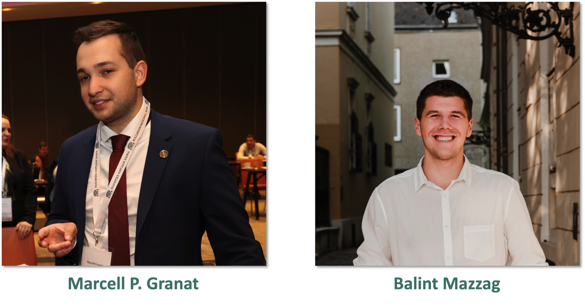

```{r include = FALSE}
library(flexdashboard)
library(tidyverse)
library(plotly)
library(printr)

knitr::opts_chunk$set(cache = TRUE, dev = "svg")
```

```{=html}
<style>
.navbar-logo img {
position: absolute;
right: 0px;
width: 80px;
}
</style>
```
# Info {data-icon="fa-info-circle"}

## Row {data-height="400"}

### What is this project?

The dashboard presents our solution to the Whiteshield Data Science competition, which includes the analysis of the skills required for the given job post pool. Our solution involves two methods to explain the necessary skills and one visuaisation of the skills gap:

1.	Counting the **number of posts** that were matched with a given **ISCO level** code. This means, that on 3 levels we can explore the number of job posts in the dataset.

2.	A **Structural Topic Model** was fitted to the corpus of the job descriptions, which resulted in 10 topics, with **differing keywords** that are present in our dataset. The topics’ occurence however differs by ISCO2 level job types, therefore it can be tracked **which jobs require which type of keywords and skills**. The words associated with the topics and the frequency of topic occurrence can be found on the third page.

3.	The **skills gap** was visualized as the difference between the ratio of ISCO3 level jobs **identified in the job post dataset** and the **ratio of unemployed people** studying in that major. Our graph shows the top 10 overdemanded and the top 10 oversupplied jobs on the Saudi labor market.

GitHub Repository of the project: <https://github.com/MarcellGranat/whiteshield>

**Find us:**

-   <https://marcellgranat.com>

-   <https://balintmazzag.netlify.app>

## Row {data-height="600"}

### The authors

```{r}

```

# Most researched majors {data-icon="fa-briefcase"}

## Most researched {.tabset}

```{r}
#| include: false

knitr::opts_chunk$set(cache.lazy = FALSE, message = FALSE)

source("utils.R")

library(treemapify)
library(janitor)
library(tidytext)
library(iscoCrosswalks)
library(ggsci)

our_colors <- c(
  "#4A8179",
  "#7F6EA8",
  "#9B6E48",
  ggsci::pal_jco()(10)[2],
  ggsci::pal_jco()(10)[-2]
)

slice_min_max <- function(df, order_by = value, n = 1) {
  
  order_by = enquo(order_by)
  
  min <- slice_min(df, !!order_by, n = n) %>%
    mutate(type = "min")
  
  max <- slice_max(df, !!order_by, n = n) %>%
    mutate(type = "max")
  
  df <- bind_rows(min, max) %>%
    as_tibble()
  
  return(df)
  
}
```

```{r}
#| label: import 

job_post_translated <- pin_read(board, "job_post_translated")
ilo_stat_df <- pin_read(board, "ilo_stat_df")
unemployed_df <- pin_read(board, "unemployed_df")
bert_merged <- pin_read(board, "bert_merged")
bert_skills <- pin_read(board, "bert_skills")
bert_matching <- pin_read(board, "BERT matching")
```

### ISCO 1

```{r}
isco_table <- iscoCrosswalks::isco

isco_n <- bert_matching %>% 
  group_by(ISCO3Label) %>% 
  summarise(n = n()) %>% 
  ungroup() %>% 
  slice_max(n, n = 16) %>% 
  left_join(ilo_stat_df) %>% 
  left_join(isco_table, by = c("ISCO2Code" = "code")) |> 
  mutate(ISCO1Code = str_sub(ISCO2Code, end = 1)) |> 
  left_join(
    isco_table |> 
      rename(
        ISCO1Code = code, 
        ISCO1Label = preferredLabel
      )
  )
```

```{r}
bert_matching |> 
  left_join(isco_table, by = c("ISCO3Label" = "preferredLabel")) |> 
  mutate(code = str_sub(code, end = 1)) |> 
  left_join(isco_table, by = c("code" = "code")) |> 
  count(preferredLabel) |> 
  mutate(preferredLabel = as.character(preferredLabel)) |> 
  drop_na() |> 
  ggplot(aes(area = n, fill = preferredLabel, label = str_wrap(preferredLabel, width = 20))) +
  geom_treemap(color = "black") +
  geom_treemap_text(grow = F, reflow = F, colour = "black") + 
  ggsci::scale_fill_jco() +
  theme(
    legend.position = "none"
  )
```

### ISCO 2

```{r}
bert_matching |> 
  left_join(isco_table, by = c("ISCO3Label" = "preferredLabel")) |> 
  mutate(code = str_sub(code, end = 2)) |> 
  left_join(isco_table, by = c("code" = "code")) |> 
  count(preferredLabel) %>% 
  left_join(isco_table) %>% 
  mutate(preferredLabel = as.character(preferredLabel),
         group = str_sub(code, end = 1)) |> 
  filter(str_length(code) == 2, !is.na(code)) %>% 
  ggplot(aes(area = n, fill = preferredLabel, subgroup = group, label = str_wrap(preferredLabel, width = 20))) +
  geom_treemap(color = "black") +
  geom_treemap_text(grow = F, reflow = F, colour = "black") + 
  scale_fill_manual(values = rep(our_colors, 10)) +
  theme(
    legend.position = "none"
  )
```

### ISCO 3

```{r}
bert_matching |> 
  left_join(isco_table, by = c("ISCO3Label" = "preferredLabel")) |> 
  mutate(code = str_sub(code, end = 3)) |> 
  left_join(isco_table, by = c("code" = "code")) |> 
  count(preferredLabel) %>% 
  left_join(isco_table) %>% 
  mutate(preferredLabel = as.character(preferredLabel),
         group = str_sub(code, end = 2)) |> 
  filter(str_length(code) == 3, !is.na(code)) %>% 
  ggplot(aes(area = n, fill = preferredLabel, subgroup = group, label = str_wrap(preferredLabel, width = 20))) +
  geom_treemap(color = "black") +
  geom_treemap_text(grow = F, reflow = F, colour = "black") + 
  scale_fill_manual(values = rep(our_colors, 10)) +
  theme(
    legend.position = "none"
  )
```

# Structural Topic Model {data-icon="fa-file-word"}

## Structural Topic Model {.tabset}

### Topic extraction from the job post

```{r}
stm_effect_10 <- pin_read(board, "stm_effect_10")
```

```{r fig.width=6}
isco2_label <- pin_read(board, "bert_merged") |> 
  mutate(ilo_line = row_number(), .before = 1) |> 
  pivot_longer(
    - ilo_line, 
    names_to = "job_post_line",
    names_transform = as.numeric,
    values_to = "similarity"
  ) |> 
  filter(similarity >= .5) |> # filter before merge
  ungroup() |> 
  left_join(ilo_stat_df |> 
              mutate(ilo_line = row_number())) |> 
  left_join(job_post_translated |> 
              mutate(job_post_line = row_number())) |> 
  select(ISCO3Code, job_post_line, JobDescription, similarity) |> 
  group_by(job_post_line) |> 
  slice_max(similarity, n = 1, with_ties = FALSE) |> 
  ungroup() |> 
  mutate(
    code = str_sub(ISCO3Code, end = 2)
  ) |> 
  count(code) |> 
  mutate(
    p = n / sum(n),
    p_label = str_c(n, " (",scales::percent(p, 1), ")")
  )

stm_effect_10 |> 
  filter(term != "(Intercept)") |> 
  mutate(
    code = str_remove(term, "ISCO2Code"),
  ) |> 
  left_join(
    iscoCrosswalks::isco
  ) |> 
  left_join(
    isco2_label
  ) |> 
  mutate(
    code_num = parse_number(code),
    preferredLabel = fct_reorder(preferredLabel, code_num)
  ) |> 
  ggplot() +
  aes(topic, preferredLabel, fill = estimate) +
  geom_tile(color = "black") +
  geom_text(aes(x = 12, y = preferredLabel, label = p_label, color = ""), size = 2) +
  scale_x_continuous(breaks = 1:10, limits = c(1, 13)) +
  scale_color_manual(values = c("#4a8179")) +
  guides(
    color = guide_legend(
      override.aes = aes(label = "4702 (2%)")
    )
  ) +
  guides(
    fill = guide_coloursteps(
      ticks = TRUE,
      ticks.colour = "black", 
      frame.colour = "black"
    )
  ) + 
  labs(
    fill = "Effect on topic prevalence",
    y = "ISCO 2",
    x = "Topic number",
    color = "Number of identified jobs      "
  ) + 
  theme(
    legend.position="bottom", 
    axis.text.y = element_text(size = 7),
    axis.title = element_text(size = 7),
    legend.box = "vertical",
    legend.key.height = unit(.2, "cm"),
    legend.key.width = unit(.5, "cm"),
    legend.text = element_text(size = 6),
    legend.title = element_text(size = 7),
  )
```

### Words in the topics

```{r}
stm_10 <- pin_read(board, "stm_10")
```

```{r}
stm_beta <- stm_10 |> 
  pluck(1) |> 
  pluck("beta") |> 
  pluck("logbeta") |>  
  as.data.frame() %>% 
  tibble() %>% 
  set_names(
    stm_10[[1]]$vocab
  ) %>% 
  mutate(id = row_number()) %>% 
  pivot_longer(-id) %>% 
  group_by(id) %>% 
  slice_max(n = 20, order_by = value)
```

```{r}
library(ggwordcloud)

wordcloud_df <- stm_beta |> 
  ungroup() %>% 
  filter(
    !id %in% c(2,5),
    !(name %in% c("description", "applicant", "job", "company", "saudi", "must", "conditions", "nationality")),
    !str_detect(name, "\\.")
  ) %>% 
  mutate(value = 10*exp(value))
```

```{r}
wordcloud_df %>%
  ggplot() + 
  geom_text_wordcloud_area(aes(label = name, size = value, color = as.character(id)), size = 2) +
  scale_size_area(max_size = 15) + 
  scale_color_jco() +
  facet_wrap(~ id) + 
  theme_bw()
```

# Skills gap {data-icon="fa-search"}

## Row {data-height="350"}

### Skill gap

```{r fig.width=9}
bert_matching |> 
  left_join(isco_table, by = c("ISCO3Label" = "preferredLabel")) |> 
  mutate(code = str_sub(code, end = 3)) %>% 
  left_join(isco_table, by = c("code" = "code")) |> 
  count(preferredLabel) %>% 
  mutate(percent = n/sum(n)) %>% 
  left_join(
    unemployed_df %>% 
      count(MajorStudy) %>% 
      transmute(
        preferredLabel = MajorStudy, 
        percent_unemp = n/sum(n))
  ) %>% 
  mutate(diff = percent-percent_unemp) %>%
  left_join(isco_table) %>% 
  filter(str_length(code) == 3) %>% 
  slice_min_max(order_by = diff, n = 10) %>% 
  arrange(diff) %>% 
  mutate(preferredLabel = fct_inorder(preferredLabel)) %>% 
  ggplot(aes(x = diff, fill = str_sub(code, end = 1), y = preferredLabel)) +
  geom_col(color = "black", size = .2) +
  geom_vline(xintercept = 0, size = .6) +
  facet_wrap(~type, scales = "free", nrow = 1) +
  theme_minimal() +
  theme(legend.position = "bottom",
        legend.direction = "horizontal",
        axis.text.y = element_text(size = 6),
        axis.text.x = element_text(size = 6),
        axis.title = element_text(size = 8),
        legend.box = "vertical",
        legend.key.height = unit(.2, "cm"),
        legend.key.width = unit(1, "cm"),
        legend.text = element_text(size = 6),
        legend.title = element_text(size = 7),
        strip.background = element_blank(),
        strip.text.x = element_blank(),
        strip.text.y = element_blank()
  ) +
  scale_x_continuous(labels = scales::percent) +
  scale_fill_manual(values = our_colors) +
  labs(x = "Gap in percent", y = NULL, fill = "ISCO 1 Label")
```
